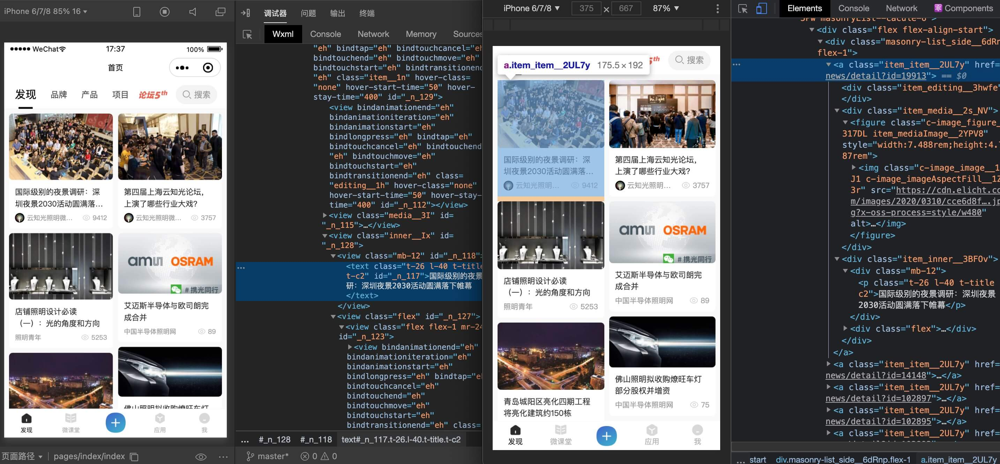
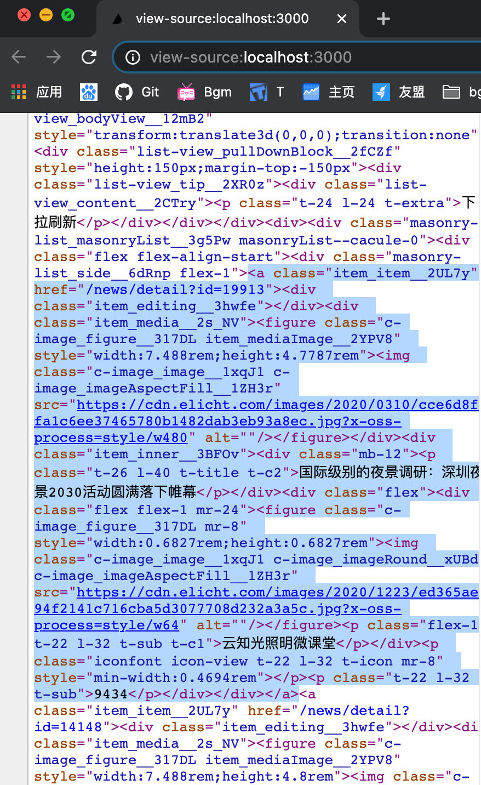

## 需求

当你接到多端小程序+H5, 还要支持小程序分享到朋友圈 和 SPA SEO 的需求的时候

百度了一大堆, 没有现成可行可靠方案, 可能大部分人会直接怼经理或者跑路 🏃?

而我很熟悉 [Taro](https://taro.aotu.io/) (多端框架) 和 [Next.js](https://nextjs.org/) (SSR 框架), 灵机一动突然就想到了这么一个可能实现的方案

并且实现后小程序端性能良好, H5 端性能极好

## 思路

大体思路就是, 用 Taro 使用 React 语法使用尽量简单的框架功能去实现页面, 小程序端能自己独立跑起来

H5 端使用 Next.js , 公用 Taro 的小程序页面代码, 不支持的 Taro 接口比如 View、Text、Taro.pxTransform 等之类的组件或接口, 使用 jsconfig.json 去映射到 H5 端文件夹, 自己封装能支持 SSR 的 H5 端组件, 组件导出 API 各端一致

SEO 需要有 a 标签, 这与小程序使用 js 跳转很冲突, 怎么办? 那就约定小程序端跳转封装一个类似 Next.js 跳转的 Link 组件, 实现小程序端渲染成 View, H5 端渲染成 a, 并包裹跳转逻辑; 类似的其他相同方向的组件接口也是这样的约定实现

甚至还能将之前写好的 Taro 开发的多端小程序, 能改动极少代码就可以支持这种模式, 粉碎老板的くそ需求

## 后续会一直开发一直补充文档

请勿参考本项目的任何代码, 你可以学习我的思路, 然后判断一下自己具不具备这样的条件去完成这种项目, 有多少坑我都没底

理论上至少你需要会熟练使用一门多端框架, 比如 Taro 或 uniapp

你需要写过小程序, 懂的小程序和 H5 之间的差异

你需要有 SSR 的经验

你可能要查看多端框架在各端实现的源码, 并且能搬运过来

更需要你有二次封装各个端缺失实现的组件的思路和能力!

喜欢用 vue 的朋友, 理论上相同的思路 uniapp + vue + nuxt 应该也是可以的

## 截图

表明我这个方案已经跑起来了

同时开发图片

H5 端 SSR 源代码

## 运行

理论上你可能 fork 本项目在本地跑起来

H5 端

你需要在根目录 yarn 装包, 在根目录 yarn dev, localhost:3000 跑起来了

小程序端

所有小程序代码都在 /weapp 下, 这个目录可以作为单独小程序目录运行

你需要进入 /weapp 目录下 yarn 装包, 还要全局安装 taro, 版本要与当前一致

之后 yarn dev:weapp, 使用小程序开发者工具打开 /dist 运行
